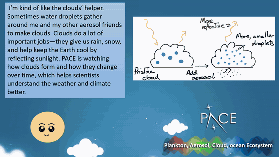
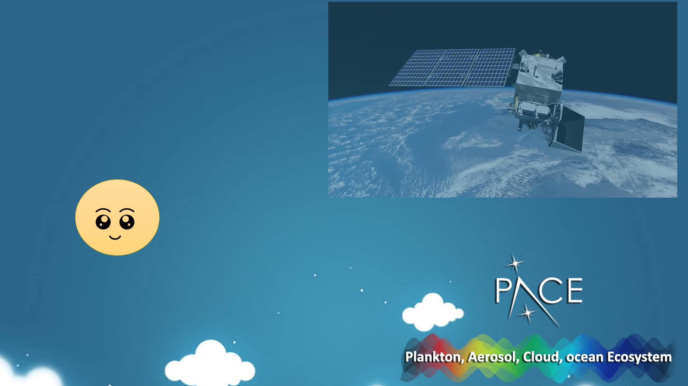

# PACE HUB

A browser based learning platform that teaches NASA's **PACE** mission to school
students, built for the **NASA International Space Apps Challenge 2024**,
challenge *PACE in the Classroom*.

Built over the hackathon weekend, 5 to 6 October 2024, by **Team Q.u.a.s.a.r**.

---

## The idea

PACE studies **P**lankton, **A**erosols, **C**louds and **o**cean **E**cosystems.
Those four things are one connected system, and that connection is the thing a
static explainer page fails to teach.

So the platform does not explain the four topics separately. It follows a single
piece of dust from a field, into the sky, across the planet, and down into the
ocean, and lets the learner discover that the four subjects are the same story
told at four scales.

Everything else in the platform hangs off that spine. The globe lets you go
looking, the quiz checks whether the story landed, and the dashboard keeps score.

---

## The story mode

The centrepiece, a three minute animated narrative built in PowerPoint.

It opens in second person. You are lying on the grass watching clouds go by. The
breeze lifts dust off the ground and carries it upward, and you start wondering
where that dust is going.



You follow it up. A guide character explains that it is *the clouds' helper*,
that water droplets gather around aerosols to form clouds, and that clouds cool
the Earth by reflecting sunlight. Then the view pulls back to the whole planet,
with PACE in orbit scanning continuously.


Then it goes down, through the surface, past the fish, to the phytoplankton, who
ask the learner for help understanding their own ecosystem.

Aerosol, cloud, ocean, plankton. One journey, four subjects, in the order the
physical system actually connects them.



---

## What is in the platform

| Page | What it does |
|---|---|
| `index.html` | PACE HUB landing, with links out to the official mission site |
| `signup.html` | Account creation and sign in |
| `Intro.html` | Mission introduction |
| `storymode.html` | The three minute animated story |
| `EarthPACE.html` | Student Exploration Hub, an interactive 3D globe |
| `quiz.html` | Phytoplankton quiz, 13 questions, Quizizz style |
| `student-dashboard.html` | Score, resources, events, news, reset progress |
| `profile.html`, `settings.html` | Profile and preferences |

**The globe** is three.js r134 with `GLTFLoader`, rendering `models/earth.glb`.
Five ocean regions are selectable, Arctic, Atlantic, Indian, Pacific and
Southern, each with its own content.


---

## Running it

Static site, no build step. Serve the folder over HTTP rather than opening the
files directly, because the `GLTFLoader` fetch for `models/earth.glb` will be
blocked by the browser on `file://`.

```bash
python -m http.server 8000
```

Then open `http://localhost:8000`.

**The two video files are not in this repository.** `story.mp4` and `earth.mp4`
are attached to the latest [release](../../releases). Download them into
`images/` and `storymode.html` and `Intro.html` will play them. Without them
those two pages load but the video panels stay empty.

---

## Repository history

This repo was **155 MB** for a static site with about 7 MB of real assets.

`story.mp4` at 105 MB and `earth.mp4` at 24 MB were committed, then deleted from
the working tree in a later commit. Deleting a file does not remove it from
history, so both were still being cloned by anyone who touched the repo. Part way
through, Git LFS was added to catch `paceintro.mp4`, which does not fix anything
already committed either.

History has been rewritten to strip every `.mp4` blob. The repo is now **43 MB**,
and `.gitignore` blocks video so it cannot happen again. Commit dates and
authorship are unchanged, and the four commits that only added or removed video
no longer exist.

The remaining weight is `models/earth.glb` at 24 MB, plus one earlier 22 MB
version of it in history. That one is a real asset the globe depends on, so it
stays.

---

## Known state

This is hackathon code from a two day event and it is published as it was
written, not tidied up afterwards.

The clearest artefact of that is in `signscript.js`, where an Express
`app.post('/signup')` handler sits at the bottom of a browser side script, under
a comment noting it is a reminder rather than frontend code. There is no backend
deployed, so account creation does not persist. The client side validation and
flow do work.

---

## Team

**Team Q.u.a.s.a.r**

Aditya Bhaty · Aditya Naidu · Nehal Mishra · Ananya Jain · Chirag Pithadia ·
Nishita Dubey

Six people, one weekend. Individual task splits were not recorded at the time and
are not reconstructed here rather than guessed at. The commits in this repository
were pushed from a single account, so the git history is not a record of who
wrote what.

My own contribution includes the PowerPoint story animation described above.

---

## Links

| | |
|---|---|
| Demo video | https://www.youtube.com/watch?v=qOUNz0Oa6RA |
| NASA PACE mission | https://pace.oceansciences.org |
| Space Apps Challenge | NASA International Space Apps Challenge 2024 |

Participation certificate, *Galactic Problem Solver*, issued 6 October 2024 and
signed by Dr. Keith Gaddis, Program Scientist.

---

## Note on assets

The story animation and the platform were made by the team. Some background
media used inside the site, including the Earth intro sequence shown above, is
stock footage and belongs to its respective owners.
